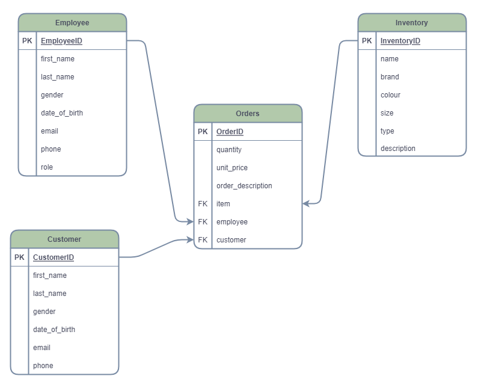

# Fashion Store CRUD App with FastAPI
This is my personal project in fastAPI creating a simple crud app for a fashion store. I'm looking for collaborations to hook it up to front end

## Running the App
For you to successfully run the app, first create a virtual environment using `python -m venv venv` then install the required packages listed below using either `pip install` or `poetry add`. Next run the development server using `uvicorn main:app --relaod` it would redirect you to a localhost address. Access the docs using  `localhostaddress/docs#/`

## Tech Stack
- Python
- Fast API
- Uvicorn
- SQlite
- SQL ALchemy
- Pydantic

## Database Schema
